# Inteligência Artificial

## Busca informada

### Algoritmo A* (A STAR) e Guloso

**Dr. Aluisio Igor Rêgo Fontes**  
Pau dos Ferros/RN, 11/07/2017

[Arquivo original em PDF](./A%20Estrela.pdf)

---

<!-- Slide 2 -->

## O que vem por aí...

- História do A*
- Aplicação
- Conceitos do Algoritmo A*
- Implementações
- Demonstrações
- Prática

---

<!-- Slide 3 -->

## Inteligência Artificial

- Bill Gates aposta na inteligência artificial para as próximas décadas.

- Inteligência Artificial (IA) tem o objetivo de elaborar dispositivos que simulem a capacidade humana de **raciocinar, perceber, tomar decisões e resolver problemas**.

---

<!-- Slide 4 -->

## História - IA

- Iniciada em 1940 com o objetivo de encontrar novas funcionalidades para o computador.
- Com o advento da Segunda Guerra Mundial, surgiu a necessidade de desenvolver a tecnologia para impulsionar a indústria bélica.
- Linha de estudos:
  - Redes neurais humanas
  - Algoritmos de buscas
  - Algoritmos genéticos
  - Lógica fuzzy
  - Processamento digital de sinais/imagens
  - Sistemas multiagentes
  - Extração de conhecimentos
  - ...

---

<!-- Slide 5 -->

## A inteligência é só humana?

> Em um primeiro momento, a inteligência era geralmente associada a uma característica unicamente humana, de representação de conhecimentos e resolução de problemas, refletindo um ponto de vista altamente antropocêntrico. Mas, ainda assim, nós, humanos, não compreendemos a nós mesmos, como funciona nossa "inteligência" e nem mesmo a origem de nossos pensamentos.

- Hoje em dia, para muitos pesquisadores, a ideia de inteligência passou a ser associada à ideia de sobrevivência e de atingir objetivos.
- Fogel: "Inteligência pode ser definida como a capacidade de um sistema de adaptar seu comportamento para atingir seus objetivos em uma variedade de ambientes".

---

<!-- Slide 6 -->

## Problema de busca

Exemplos de espaços nos quais se pode procurar um caminho:

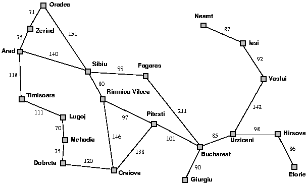

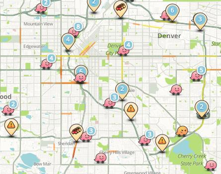

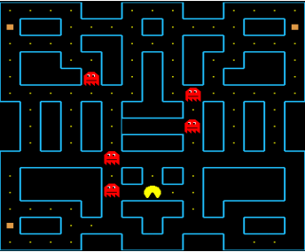

---

<!-- Slide 7 -->

## Algoritmo A*

### Passos para executar o A*

- Estabelecer a área de procura.
- Estabelecer os nós.
- Pontuar os nós com a fórmula:

  $$F = G + H$$

  - **G** é o custo do movimento para se mover em uma direção.
  - **H** é o custo estimado do movimento do quadrado atual até o destino final.

### Custo G

- Utilizaremos o teorema de Pitágoras.
- Movimento horizontal ou vertical: **10**.
- Movimento diagonal: **14**.

### Heurística H

- Distância de Manhattan.
- $D = 10$.
- Desconsiderar paredes.

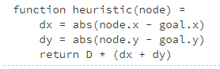

---

<!-- Slide 8 -->

## Algoritmo A* - Graduação do caminho

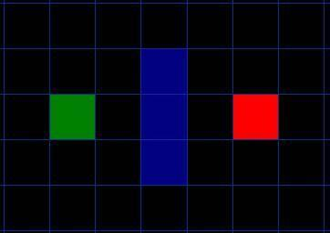

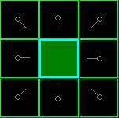

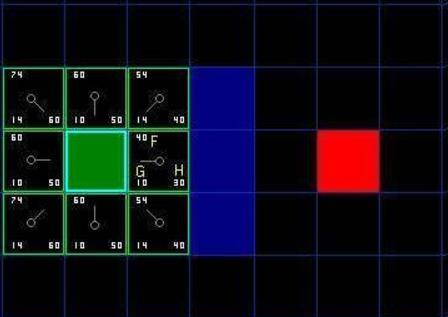

---

<!-- Slide 9 -->

## Algoritmo A* - Exploração

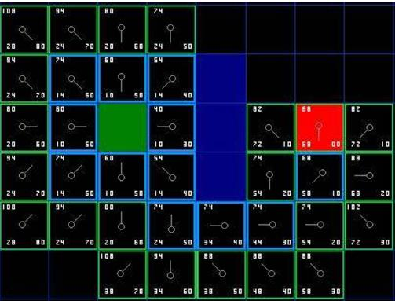

---

<!-- Slide 10 -->

## Algoritmo A* - Seleção e expansão

Escolha o quadrado que contém o menor valor de **F** entre todos os que estão na lista aberta.

1. Retire-o da lista aberta e acrescente-o à lista fechada.
2. Confira todos os quadrados adjacentes. Ignore os que estão na lista fechada ou não são passáveis. Acrescente os demais à lista aberta, caso ainda não estejam nela, e defina o quadrado selecionado como pai dos novos quadrados.
3. Se um quadrado adjacente já estiver na lista aberta, confira se o caminho até ele é melhor. Em outras palavras, verifique se o valor de **G** para aquele quadrado fica menor ao usar o quadrado atual para chegar até lá. Se não ficar, não faça nada.
4. Se o custo **G** do novo caminho for menor, troque o pai do quadrado adjacente para o quadrado selecionado. Finalmente, recalcule os valores de **F** e **G** daquele quadrado.

---

<!-- Slide 11 -->

## Resumo do algoritmo

1. Adicione o quadrado inicial à lista aberta.
2. Repita o seguinte:
   1. Procure, na lista aberta, o quadrado que tenha o menor custo **F**. Ele será chamado de quadrado corrente.
   2. Mova-o para a lista fechada.
   3. Para cada um dos oito quadrados adjacentes ao quadrado corrente:
      1. Se não for passável ou estiver na lista fechada, ignore-o.
      2. Caso contrário:
         - Se não estiver na lista aberta, acrescente-o a ela. Defina o quadrado atual como pai desse quadrado e grave seus custos **F**, **G** e **H**.
         - Se já estiver na lista aberta, confira se o caminho até ele é melhor usando o custo **G** como medida. Um valor **G** menor representa um caminho melhor. Nesse caso, altere o pai para o quadrado atual e recalcule os valores de **G** e **F**. Se a lista aberta estiver ordenada por **F**, reordene-a para corresponder à mudança.
   4. Pare quando:
      - o quadrado-alvo for acrescentado à lista fechada, o que indica que o caminho foi encontrado; ou
      - o quadrado-alvo não for encontrado e a lista aberta estiver vazia. Nesse caso, não há caminho.
3. Salve o caminho. Partindo do quadrado-alvo, caminhe pelos quadrados-pai até alcançar o quadrado inicial. Esse é o caminho encontrado.

---

<!-- Slide 12 -->

## Demonstração

---

<!-- Slide 13 -->

## Interface gráfica

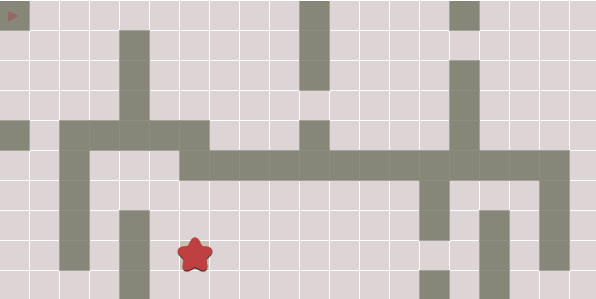

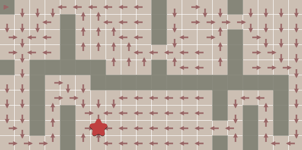

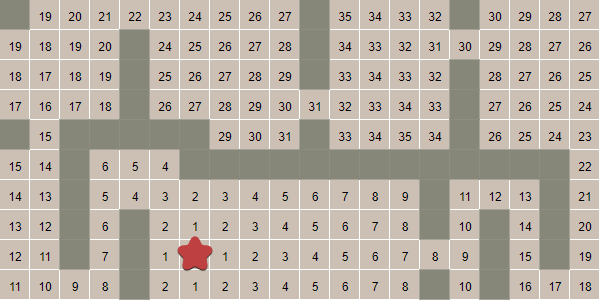

---

<!-- Slide 14 -->

## Interface gráfica

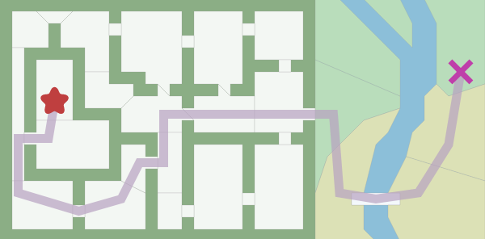

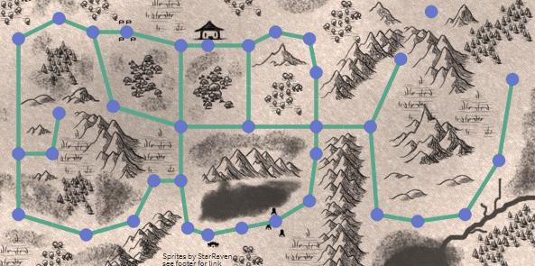

---

<!-- Slide 15 -->

## Atividade

- **Interface gráfica (18/07)**
  - Mostrar os visitados.
  - Exibir os valores de **G**, **H** e **F**.
  - Carregar três labirintos e permitir o desenho manual.
- **Algoritmo A* (25/07)**
  - Distância de Manhattan.
  - Distância diagonal.
  - Distância euclidiana.
  - Múltiplos objetivos.
- **Algoritmo guloso (01/08)**
- **Variações do A* (08/08)**
- **Artigo (15/08)**
